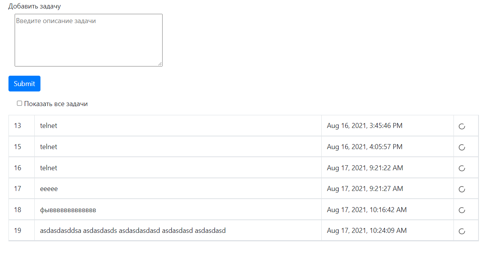

# Проект "To DO" лист

* [Описание](#описание)
* [Функционал](#функционал)
* [Технологии](#технологии)
* [Автор](#автор)

## Описание
MVC REST API - приложение, todo-список дел.
Для хранения данных применяется Hibernate. Данные на главную страницу
(где располагается сам список действий и интерфейс работы с ним) 
подгружаются через AJAX-запросы, которые возвращают данные в формате JSON. 
При изменении списка он так же изменяется динамически без перезагрузки страницы.

## Функционал
* Добавление задачи в TODO-list
* Вывод всех задач
* Вывод только незавершённых задач
 
## Технологии
* Hibernate
* Java14
* PostgreSQL
* AJAX jquery
* Servlet&JSP
* HTML, BOOTSTRAP
* Apache Tomcat Server
* Junit
* Travis CI

* Основная страница 
  

## Автор

Маркелов Роман Игоревич

Java-разработчик

roman.sercent@gmail.com

+79178764086

