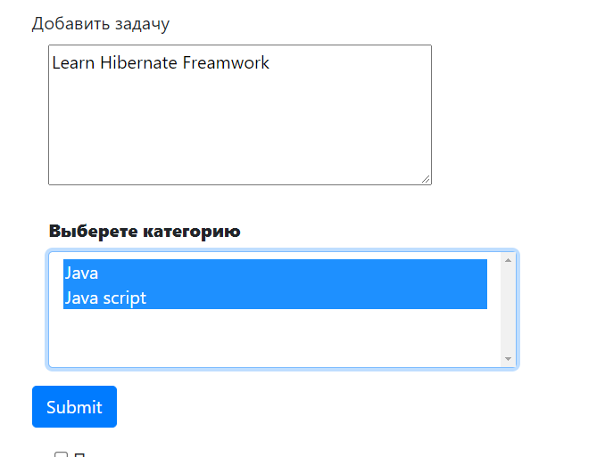
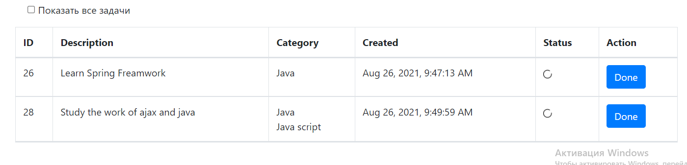

# Проект "To DO" лист

* [Описание](#описание)
* [Функционал](#функционал)
* [Технологии](#технологии)
* [Архитектура](#архитектура)
* [Интерфейс](#интерфейс)
* [Автор](#автор)

## Описание
MVC REST API - приложение, todo-список дел.
Для хранения данных применяется Hibernate. Данные на главную страницу
(где располагается сам список действий и интерфейс работы с ним) 
подгружаются через AJAX-запросы, которые возвращают данные в формате JSON. 
При изменении списка он так же изменяется динамически без перезагрузки страницы.

## Функционал
* Регистрация пользователя
* Авторизация через БД PostgreSQL
* Добавление задачи в TODO-list
* Пометить задачу как выполненную
* Вывод всех задач
* Вывод только незавершённых задач
* Для каждого зарегистрированного пользователя хранится свой собственный список
 
## Технологии
* Hibernate
* Java14
* PostgreSQL
* AJAX jquery
* Servlet&JSP
* HTML, BOOTSTRAP
* Apache Tomcat Server
* Junit
* Travis CI

## Архитектура
Проект реализован по шаблону MVC и разделён на слои:

1. Модели данных(Model)
   1.1 [Item](src/main/java/model/Item.java) -
    Модель для хранения данных задачи.
   1.2 [User](src/main/java/model/User.java) -
    Модель для хранения данных пользователя. 

2. Хранилища(Store)
   
   2.1.1 [UserStore](src/main/java/store/UserStore.java) -
   Инерфейс для Hibernate - хранилища пользователей. 
    
   2.1.2 [HbrUserStore](src/main/java/store/HbrUserStore.java) -
   Hibernate-хранилище для авторизационных пользователей.
   
   2.2.1 [ItemStore](src/main/java/store/ItemStore.java) -
   Инерфейс для Hibernate - хранилища задач из TODO-списка.    

   2.2.2 [HbrItemStore](src/main/java/store/HbrItemStore.java) -
   Hibernate-хранилище для задач из TODO-списка.
   
   2.3.1 [HbrService](src/main/java/store/HbrService.java)
   Абстрактный класс для общих переменных 

3. JSP - View

   3.1 [index.jsp](src/main/webapp/index.jsp) - главная страница приложения.
   На ней отображаются все задачи и интерфейс взаимодействия с ними, форма для
   добавления новых задач.
   
   3.2 [auth.jsp](src/main/webapp/login.jsp) - страница авторизации. Поддерживает валидацию данных.
   Если пользователя с данным логином не существует быдет вывидено сообщение об ошибке.
   
   3.3 [reg.jsp](src/main/webapp/reg.jsp) - страница регистрации. Поддерживает валидацию даннных.
   Если пользователь с введённым логином уже существует, будет вывидено сообщение об ошибке.

4. Сервлеты - Controller

   4.1 [AuthServlet](src/main/java/servlet/LoginServlet.java) -
   Сервлет авторизации. Принимает запрос с JSP, производит валидацию введённых
   пользователем данных, существует ли в PostgreSQL хранилище такой пользователь. В случае успешной авторизации, добавляет
   пользователя в Http-сессию.

   4.2 [RegServlet](src/main/java/servlet/RegServlet.java) -
   Сервлет регистрации. Принимает запрос с JSP, производит валидацию. В случае успешной
   регистрации добавляет нового пользователя в PostgreSQL- хранилище и переводит на страницу авторизации.

   4.3 [IndexServlet](src/main/java/servlet/IndexServlet.java) -
   Сервлет обмена данными.
   * doGet метод - отправка актуальных данных о списке задач в формате JSON
   в ответ на AJAX-запрос на главную страницу приложения.
   * doPost метод:
   Добавление новой задачи в хранилище.

   4.4 [DoneServlet](src/main/java/servlet/DoneServlet.java) -
   Сервлет для завершения задания
   
   

## Интерфейс

* Регистрируемся
  

* Авторизируемся 
  

* вводим верный пароль
  

* Добавляем задачи
  

* По умолчанию мы видем только незвершеные задачи
  

* Нажимаем галку и видем все задачи
  
  
## Автор

Маркелов Роман Игоревич

Java-разработчик

roman.sercent@gmail.com

+79178764086

