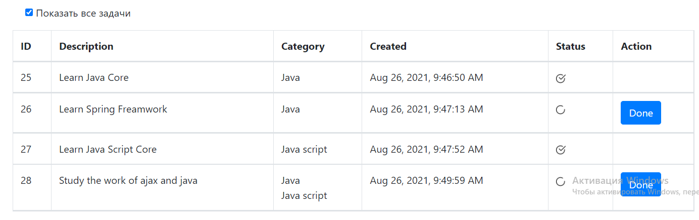

# Проект "To DO" лист

* [Описание](#описание)
* [Функционал](#функционал)
* [Технологии](#технологии)
* [Автор](#автор)

## Описание
MVC REST API - приложение, todo-список дел.
Для хранения данных применяется Hibernate. Данные на главную страницу
(где располагается сам список действий и интерфейс работы с ним) 
подгружаются через AJAX-запросы, которые возвращают данные в формате JSON. 
При изменении списка он так же изменяется динамически без перезагрузки страницы.

## Функционал
* Регистрация пользователя
* Авторизация через БД PostgreSQL
* Добавление задачи в TODO-list
* Пометить задачу как выполненную
* Вывод всех задач
* Вывод только незавершённых задач
* Для каждого зарегистрированного пользователя хранится свой собственный список
 
## Технологии
* Hibernate
* Java14
* PostgreSQL
* AJAX jquery
* Servlet&JSP
* HTML, BOOTSTRAP
* Apache Tomcat Server
* Junit
* Travis CI

* Регистрируемся
  

* Авторизируемся 
  

* вводим верный пароль
  

* Добавляем задачи
  

* По умолчанию мы видем только незвершеные задачи
  

* Нажимаем галку и видем все задачи
  
  
## Автор

Маркелов Роман Игоревич

Java-разработчик

roman.sercent@gmail.com

+79178764086

